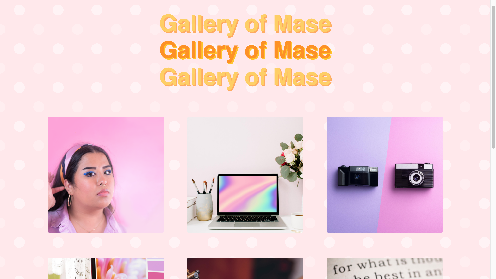
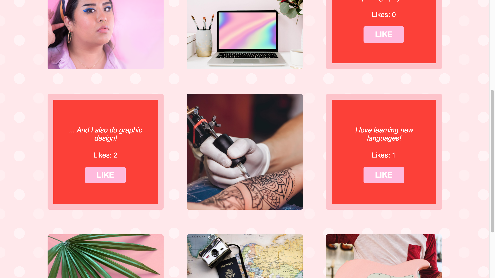

#   Gallery of Mase : React Photo Gallery

### Built By:
Mase Santos
>Duration: Weekend Sprint

## Application Overview
This application serves as a gallery page to share pictures of my interests, hobbies, and skillset. Visitors can click on an image to see a description and use a button to "like" an image should they choose. By viewing the content of this application, visitors can get to know me beyond my resume!

## Application Views

## Installation

1. npm intall  
2. npm run client
3. npm run server

## Usage

1. Scroll through the gallery to see my interests!
2. To see the description paired with the photo, click on the photo you want to learn more about. The "backside" of the photo card will appear with details, a count of total likes, and a "Like" button.
3. Every time the "Like" button is clicked, the counter will go up by one for the specific photo, and the photo card will flip back to the image.

## Technologies Used

- JavaScript
- React
- Node.js
- Express.js
- Canva, for sizing and stock images

## Acknowledgement
Thank you to my instructors [Mary](https://github.com/mbMosman) and [Dev](https://github.com/devjanaprime), as well as the Paxos cohort at [Prime Digital Academy!](www.primeacademy.io)! 
